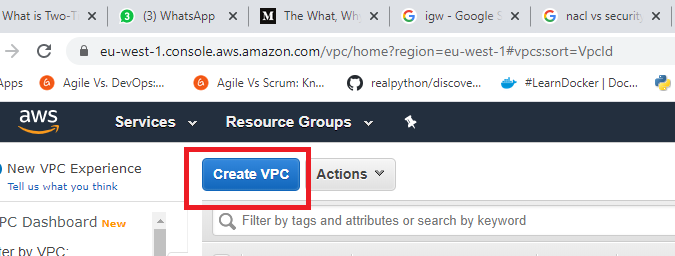

# Networking

### Availability Zones

- An availability zone is one or more discrete data centres with redundant power, networking and connectivity in
an AWS region

- AZ's are logically connected but physically segregated

- They give customers the ability to operate applications and database that woid

## Creating a VPC on AWS

We first click on VPC on the dashboard of AWS and then click

Once here we fill in the following configurations

### Inbound and Outbound Rules

#### INGRESS

- Development Ports (8080 and 3000) These would be able to be accessed by any IP
- Internet ports for the world
- SSH port for ourselves and automation servers (22), this would be accessed by just our IP
- 

#### EGRESS

- By default on our web app this was set to 0.0.0.0/0 thus meaning the app could communicate
with anything

### NACLs for public

#### INGRES
- Allow port 80 for web servers
- Allow ephemeral ports, this allows update, thus when we c
- Allow port 443
- Allow port 22

#### EGRESS
- Allow all out

### NACLs for private

#### Ingress

- 27017 from the public subnet 

#### EGRESS

- Allow all to the public subnet

We should then be able to see the NGINX welcome page on our web browser, meaning we successfully
connected to the internet!