# Networking

## Virtual Private Cloud

- A VPC is a secure, isolated private cloud which is hosted within a public cloud

## What is inside a 2 tier VPC

1. Web Tier
2. Database Tier

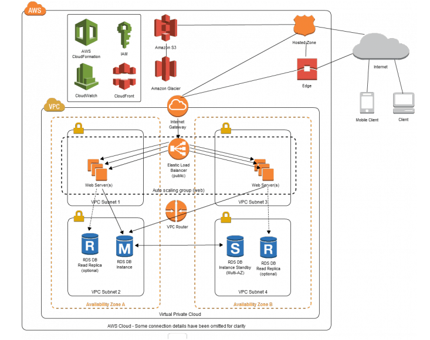

### Why do we do this

- We create subnets within our VPC, they give different access rules and place resources in different containers
- E.g You would not want your database with contains secret information to be put in a public subnet where there is 
network traffic. Instead we would want to place it in a private subnet
- Creating subnets allows you to create a logical network division between the different resources you have

### We also use two other forms of technology for isolating a VPC from the public cloud

#### VLAN

- A virtual local area network is a group of computing devices that are all connected to each other without the use
of the internet

#### VPN

- A virtual private network uses encryption to create a private network over the top of your current public network,
this causes the traffic to be scrambled and thus is not easily visible to anyone.

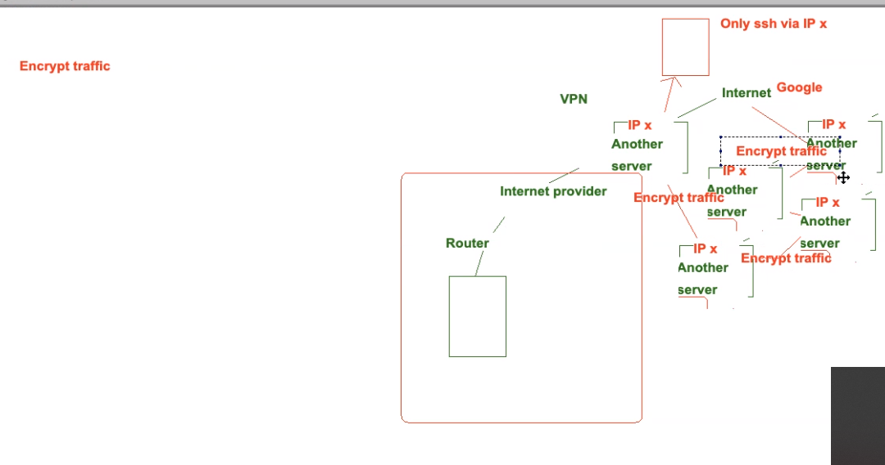

- As we can see above, the request sent from our internet provider has been sent to multiple other servers before it reaches
the desired internet location and thus it is hard to figure out the original location of the request

- These multiple layers of encyption could also be referred to as a *Tor Network*

## Monolithic Architecture

### Availability Zones

- An availability zone is one or more discrete data centres with redundant power, networking and connectivity in
an AWS region

- AZ's are logically connected but physically segregated

- They give customers the ability to operate applications and database that woid

### Internet Gateways (IGWs)

- An optional virtual router that you can add to your VPC to enable direct connectivity to the internet, allowing communication
between your VPC and the outside world.

- For an EC2 instance to talk to the outside world, the instance must be located on a public subnet that has a route table 
rule that specifies the IGW as the target

- Internet can then travel through the IGW into the VPC and then into the route table, from here it can travel to the public
subnet where the EC2 is located

### Network Access Control List (NACLs)

- Virtual Network-level firewalls that are associated to each and every subnet

- Help control both ingress and egress (incoming, outbound) traffic moving in and out of your VPC and between your subnets.

### Security Groups (SGs)

- Firewall at the instance level

- Controls the traffic entering and leaving our instance

### Difference Between Security Groups and Network ACLs

- Security Groups are a firewall of an Instance
- Network ACLs are a firewall of a subnet
- Together they act as multiple layers of security
- **Note that if we do not allow traffic at the subnet level but allow it at the instance level, it would not pass the
the first layer of security and thus would not reach our instance**

### Route Tables

- A route table contains a set of rules, called routes, that are used to determine where network traffic from your subnet
or gateway is directed.

- 

## Creating a VPC on AWS

1) We first click on VPC on the dashboard of AWS and then click

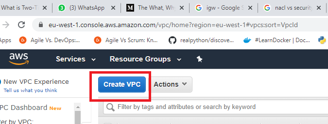

2) Once here we fill in the following configurations

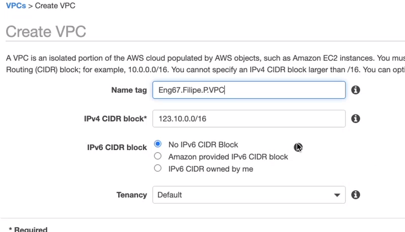

## Creating An Internet Gateway

1) Choose the Internet Gateway from the left sidebar

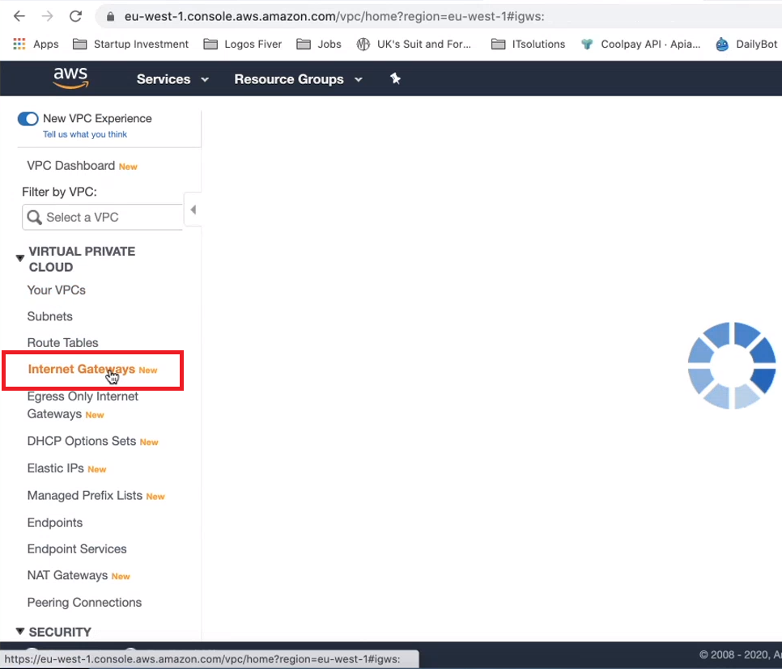

2) We can then fill in the following configurations

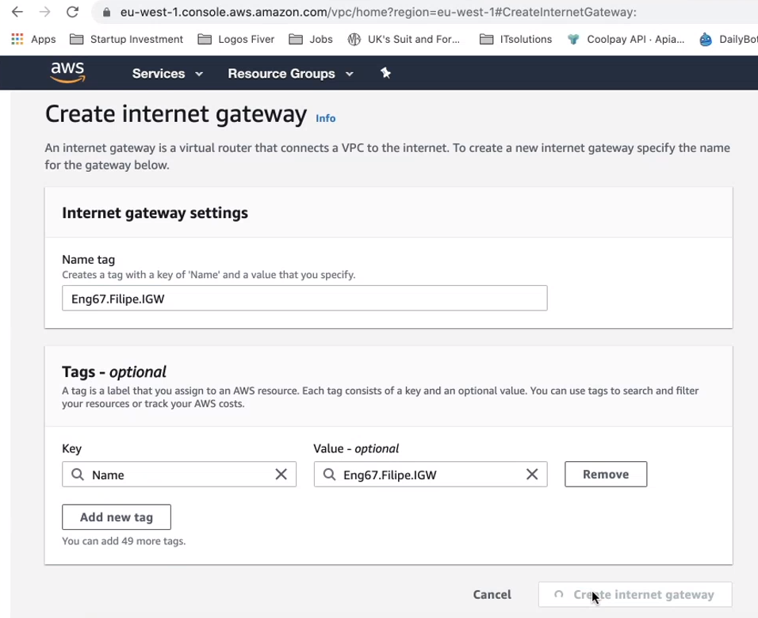

3) Now when we save this gateway we will see that it's state is 'detached', we will now attach it to a VPC

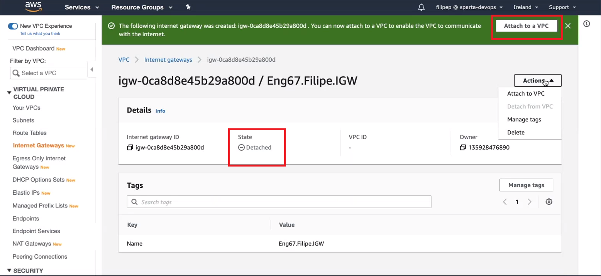

4) And we now type in the name of our VPC and make the attachment

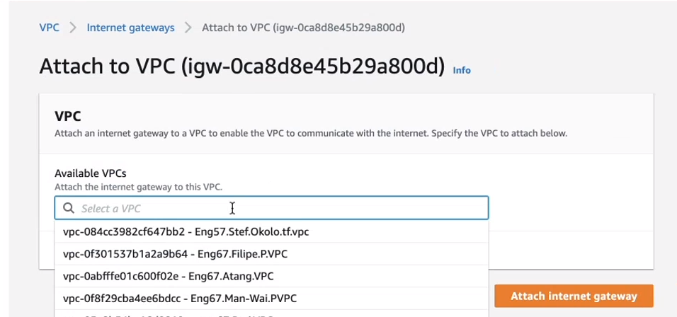

- The theory for this step can be described looking at the diagram below

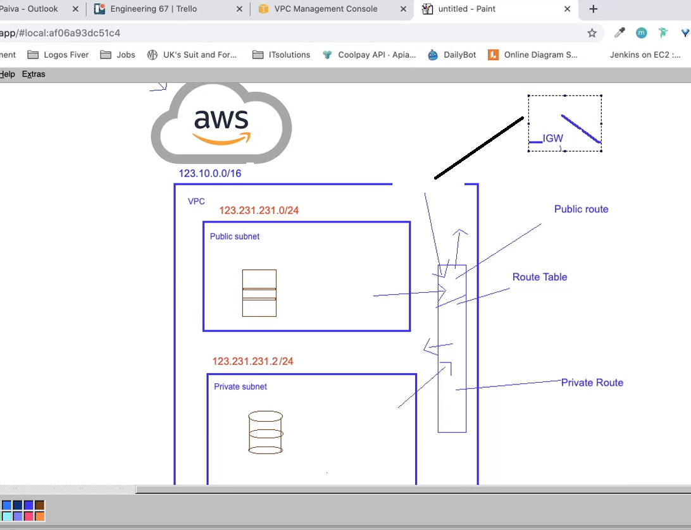

- Both the VPC and IGW have been created, however we need to connect the two together

## Creating A Private And Public Subnet On AWS

1) We can the Subnets services on the left side bar

2) First we will create our public subnet

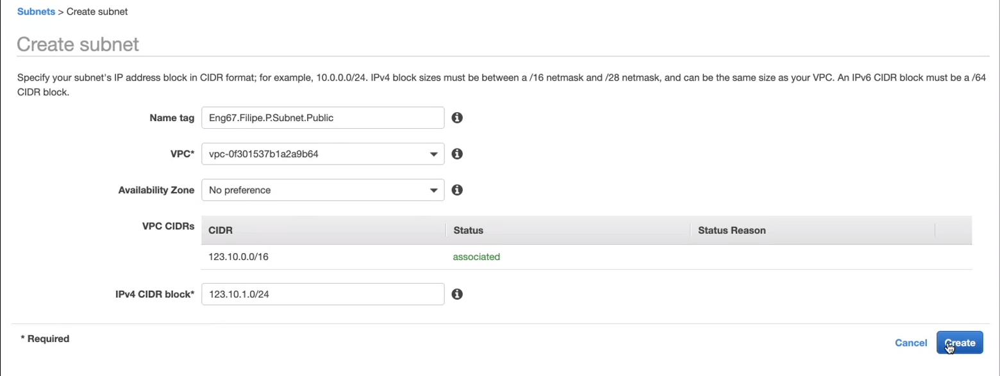

3) Now for our private subnet

### Inbound and Outbound Rules

#### INGRESS

- Development Ports (8080 and 3000) These would be able to be accessed by any IP
- Internet ports for the world
- SSH port for ourselves and automation servers (22), this would be accessed by just our IP

#### EGRESS

- By default on our web app this was set to 0.0.0.0/0 thus meaning the app could communicate
with anything

### NACLs for public

#### INGRES
- Allow port 80 for web servers
- Allow ephemeral ports, this allows update, thus when we c
- Allow port 443
- Allow port 22

#### EGRESS
- Allow all out

### NACLs for private

#### Ingress

- 27017 from the public subnet 

#### EGRESS

- Allow all to the public subnet

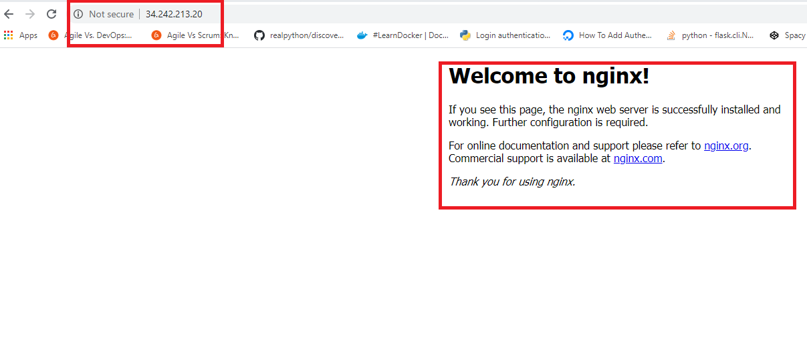

We should then be able to see the NGINX welcome page on our web browser, meaning we successfully
connected to the internet!