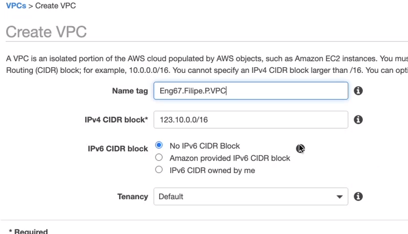
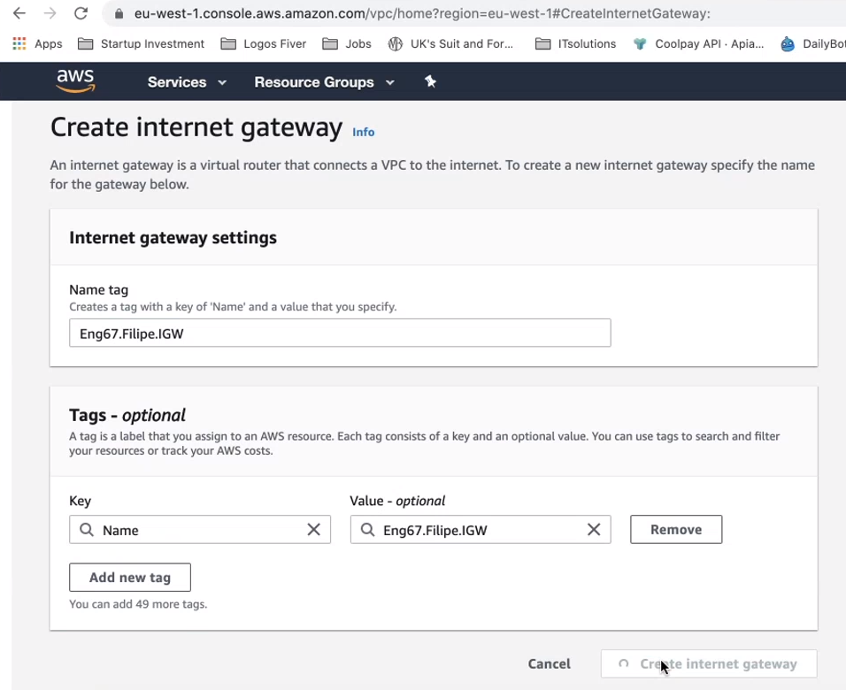
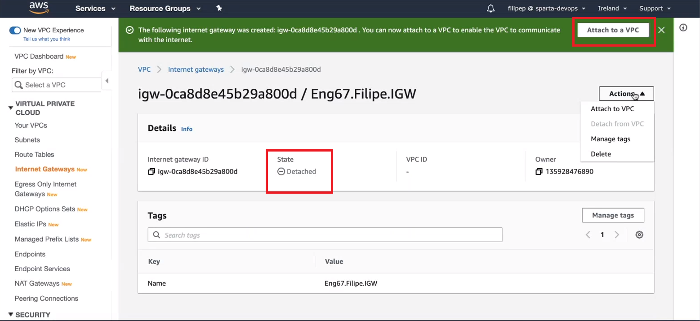
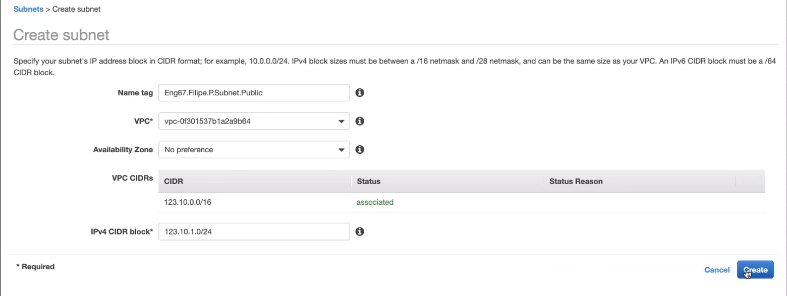
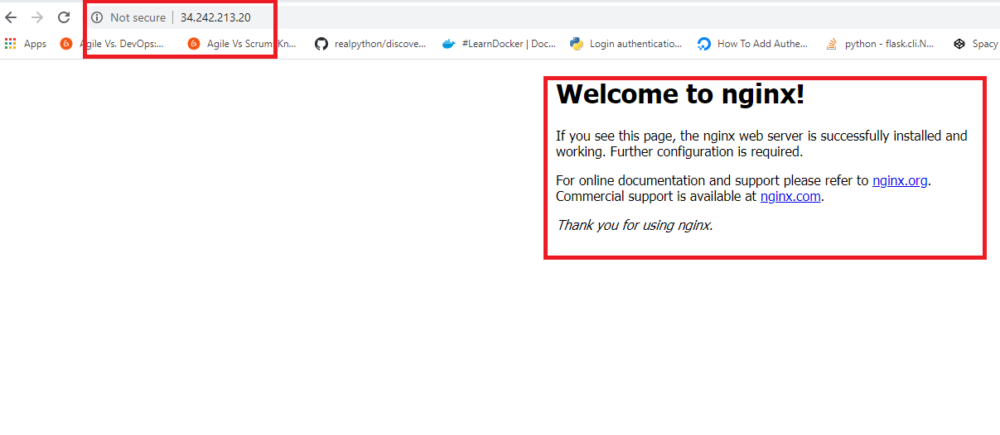

# Creating a VPC on AWS

1) We first click on VPC on the dashboard of AWS and then click

2) Once here we fill in the following configurations

## Creating An Internet Gateway

1) Choose the Internet Gateway from the left sidebar

2) We can then fill in the following configurations

3) Now when we save this gateway we will see that it's state is 'detached', we will now attach it to a VPC

4) And we now type in the name of our VPC and make the attachment

- The theory for this step can be described looking at the diagram below

- Both the VPC and IGW have been created, however we need to connect the two together

## Creating A Private And Public Subnet On AWS

1) We can the Subnets services on the left side bar

2) First we will create our public subnet

3) Now for our private subnet

### Inbound and Outbound Rules

#### INGRESS

- Development Ports (8080 and 3000) These would be able to be accessed by any IP
- Internet ports for the world
- SSH port for ourselves and automation servers (22), this would be accessed by just our IP

#### EGRESS

- By default on our web app this was set to 0.0.0.0/0 thus meaning the app could communicate
with anything

### NACLs for public

#### INGRES
- Allow port 80 for web servers
- Allow ephemeral ports, this allows update, thus when we c
- Allow port 443
- Allow port 22

#### EGRESS
- Allow all out

### NACLs for private

#### Ingress

- 27017 from the public subnet 

#### EGRESS

- Allow all to the public subnet

We should then be able to see the NGINX welcome page on our web browser, meaning we successfully
connected to the internet!